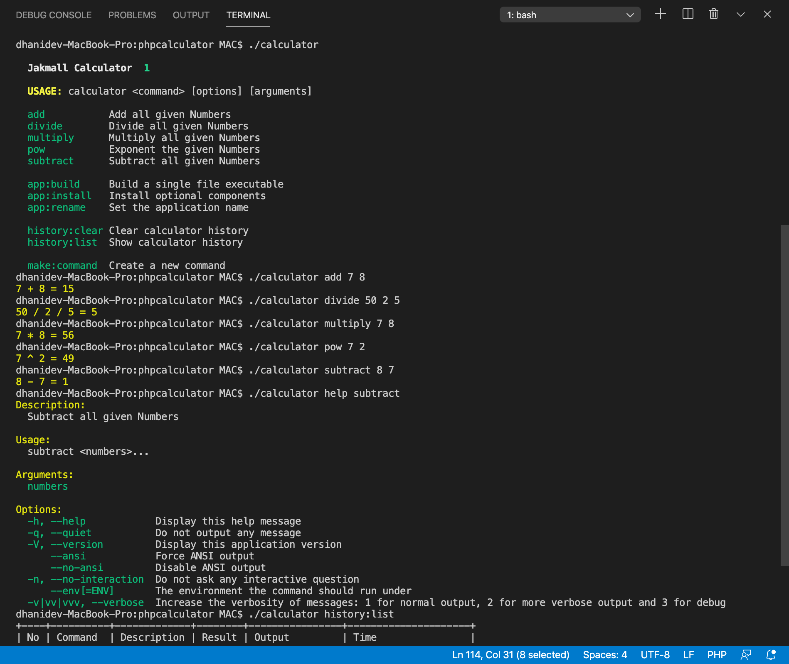
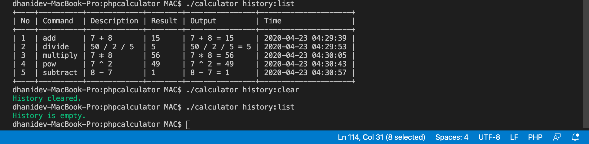

# Jakmall Calculator

## Software Requirements
- Docker

## Vendor installation
```
./composer install
```
## Run the Calculator
```
./calculator
```
## Additional Library
	-- LARAVEL ZERO

## License

Laravel Zero is an open-source software licensed under the [MIT license](https://github.com/laravel-zero/laravel-zero/blob/stable/LICENSE.md).

## Footnote
1. add library laravel-zero for addtional library
2. tidy up the directories
	* every commands i put into /app (library needs)
	* app.php & commands.php i put into /config
3. modify composer.json to instantly build the apps
4. add app:build, app:install, app:rename & make:command to make it easier

## Result





